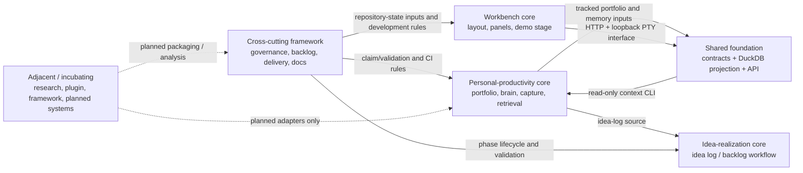

# System Boundary Study — Current Boundary Map

## Baseline and reading key

**Baseline:** `2fd11e9ccabc15dbab227e78e05c08b68750396c` on 2026-09-26. This map is a current-state evidence map, not a decision to split a repository or move data. It is derived from the system registry and the two supporting architecture records named in the phase scope; no `_private/` material was read.

Solid arrows are implemented or explicitly current contracts. Dashed arrows are planned contracts and must not be treated as runtime capability.

## Crossings and ownership rules

| Boundary | Current crossing | Evidence | Prohibited ownership crossing |
| --- | --- | --- | --- |
| Personal productivity → shared foundation | `_data/` and `brain/` are rebuilt into DuckDB; retrieval reads the projection | `sys-portfolio`, `sys-brain`, `sys-projection`, `ARCH-002` | DuckDB must not become the durable authority for portfolio or memory records. |
| Personal productivity → idea realization | The idea log is a portfolio source; realization proposes a path from capture to verified delivery | `sys-portfolio`, `sys-realization`, `ARCH-006` | The realization pipeline must not change idea lifecycle/lineage or owner approvals outside the established record and gate rules. |
| Idea realization → framework | Backlog dependency/claim validation and governance records are workflow inputs | `sys-realization`, `sys-backlog`, `sys-governance`, `ARCH-006` | Governance must not decide product priority, integration, or completion; those remain owner gates. |
| Workbench → shared foundation | Browser panels use the FastAPI surface; terminal reaches the loopback-gated demo PTY backend | `sys-api`, `sys-wb-terminal`, `sys-demo-stage` | A panel must not own or bypass the PTY backend's loopback/gating controls. |
| Workbench internal seam | Explorer imports a viewer compatibility constant; cross-slot actions use shared `panelBridge` | `sys-wb-explorers`, `sys-wb-viewer`, `sys-wb-shared` | Explorer code must not take ownership of viewer cache/staleness policy merely because of this dependency. |
| Framework → all cores | CI, document validation, phase locking and governance prose constrain repository work | `sys-delivery`, `sys-governance`, `sys-backlog`, `sys-gov-docs` | Framework systems must not become the authority for portfolio content, workbench user state, or business outcomes. |
| Adjacent/incubating → cores | Plugin, portable framework, research, demo kit, signals and automation have documented intentions but uneven/no runtime contracts | `sys-plugin*`, `sys-fw-*`, `sys-research`, `sys-demo-kit`, `sys-signals`, `sys-auto-*` | A planned or adjacent system must not be represented as an implemented interface or silently absorb a core's data authority. |

## Limits

- Registry descriptions establish intended ownership and named source paths; they do not prove every runtime import or external integration.
- The map intentionally shows no `_private/` data path. The registry identifies that boundary but this study did not inspect it.
- Planned systems are represented as dashed/qualified relationships only. Their operational writers, readers, and interfaces remain unknown until implementation evidence exists.
