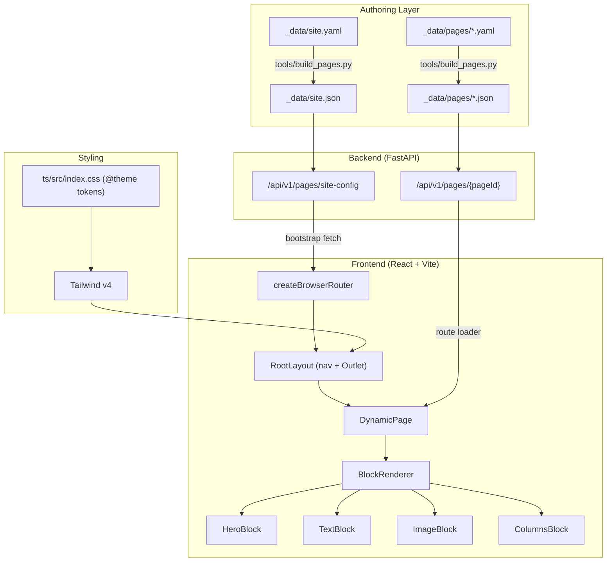

> Delivery is approved in phases. The [accepted user choices](../../08-governance/GOV-003-backlog-decisions.md) resolve conflicting details below; the [session backlog](../../09-backlog/README.md) tracks execution and completion. This document is a design source, not evidence of implementation.

# Dynamic HTML Generation Website Tool — Overview

## Goal

Build a data-driven dynamic page rendering system for D-System. Configuration files define site structure, page content (as composable blocks), and theming. React renders pages by fetching config from FastAPI, which reads from `_data/pages/` JSON files. Authors write page configs in YAML; a deterministic build script converts them to JSON validated by JSON Schema.

## Decisions

| Decision | Choice | Rationale |
|---|---|---|
| Data pipeline | FastAPI-served (`/api/v1/pages/{pageId}`) | Single data pipeline; no parallel static-file system |
| Config location | `_data/pages/` | Consistent with existing `_data/` entities |
| Entry point | Merge into existing `App.tsx` → `RouterProvider` | One entry point, no parallel app |
| Styling | Tailwind CSS v4 (CSS-first `@theme`) | Fast prototyping, consistent design system |
| Authoring format | YAML → JSON via `tools/build_pages.py` | YAML for readability + comments; JSON for consumption |
| Router | `createBrowserRouter` (React Router 6.4+ data API) | Route-level loaders, error boundaries, pending states |

## Architecture

## File Manifest

| Action | File | Layer | Plan Doc |
|---|---|---|---|
| NEW | `tools/build_pages.py` | Build tool | [PLAN-003.01-build-tooling.md](PLAN-003.01-build-tooling.md) |
| NEW | `schemas/site.schema.json` | Schema | [PLAN-003.01-build-tooling.md](PLAN-003.01-build-tooling.md) |
| NEW | `schemas/page.schema.json` | Schema | [PLAN-003.01-build-tooling.md](PLAN-003.01-build-tooling.md) |
| NEW | `_data/site.yaml` | Data | [PLAN-003.05-sample-data.md](PLAN-003.05-sample-data.md) |
| NEW | `_data/pages/home.yaml` | Data | [PLAN-003.05-sample-data.md](PLAN-003.05-sample-data.md) |
| NEW | `_data/pages/about.yaml` | Data | [PLAN-003.05-sample-data.md](PLAN-003.05-sample-data.md) |
| NEW | `src/models/pages.py` | Backend | [PLAN-003.02-backend.md](PLAN-003.02-backend.md) |
| NEW | `src/api/routes/pages.py` | Backend | [PLAN-003.02-backend.md](PLAN-003.02-backend.md) |
| MODIFY | `src/api/__init__.py` | Backend | [PLAN-003.02-backend.md](PLAN-003.02-backend.md) |
| MODIFY | `pyproject.toml` | Backend | [PLAN-003.02-backend.md](PLAN-003.02-backend.md) |
| MODIFY | `ts/vite.config.ts` | Frontend | [PLAN-003.03-frontend-setup.md](PLAN-003.03-frontend-setup.md) |
| NEW | `ts/src/index.css` | Frontend | [PLAN-003.03-frontend-setup.md](PLAN-003.03-frontend-setup.md) |
| NEW | `ts/src/types/schema.ts` | Frontend | [PLAN-003.04-frontend-components.md](PLAN-003.04-frontend-components.md) |
| MODIFY | `ts/src/main.tsx` | Frontend | [PLAN-003.03-frontend-setup.md](PLAN-003.03-frontend-setup.md) |
| NEW | `ts/src/router.tsx` | Frontend | [PLAN-003.03-frontend-setup.md](PLAN-003.03-frontend-setup.md) |
| NEW | `ts/src/layouts/RootLayout.tsx` | Frontend | [PLAN-003.04-frontend-components.md](PLAN-003.04-frontend-components.md) |
| NEW | `ts/src/pages/DynamicPage.tsx` | Frontend | [PLAN-003.04-frontend-components.md](PLAN-003.04-frontend-components.md) |
| NEW | `ts/src/pages/NotFoundPage.tsx` | Frontend | [PLAN-003.04-frontend-components.md](PLAN-003.04-frontend-components.md) |
| NEW | `ts/src/components/ErrorBoundary.tsx` | Frontend | [PLAN-003.04-frontend-components.md](PLAN-003.04-frontend-components.md) |
| NEW | `ts/src/components/BlockRenderer.tsx` | Frontend | [PLAN-003.04-frontend-components.md](PLAN-003.04-frontend-components.md) |
| NEW | `ts/src/components/blocks/HeroBlock.tsx` | Frontend | [PLAN-003.04-frontend-components.md](PLAN-003.04-frontend-components.md) |
| NEW | `ts/src/components/blocks/TextBlock.tsx` | Frontend | [PLAN-003.04-frontend-components.md](PLAN-003.04-frontend-components.md) |
| NEW | `ts/src/components/blocks/ImageBlock.tsx` | Frontend | [PLAN-003.04-frontend-components.md](PLAN-003.04-frontend-components.md) |
| NEW | `ts/src/components/blocks/ColumnsBlock.tsx` | Frontend | [PLAN-003.04-frontend-components.md](PLAN-003.04-frontend-components.md) |
| DELETE | `ts/src/App.tsx` | Frontend | [PLAN-003.03-frontend-setup.md](PLAN-003.03-frontend-setup.md) |
| MODIFY | `ts/package.json` | Frontend | [PLAN-003.03-frontend-setup.md](PLAN-003.03-frontend-setup.md) |

## Plan Documents

| Doc | Focus |
|---|---|
| [PLAN-003.01-build-tooling.md](PLAN-003.01-build-tooling.md) | YAML→JSON converter, JSON Schemas |
| [PLAN-003.02-backend.md](PLAN-003.02-backend.md) | Pydantic models, FastAPI endpoints, dependency changes |
| [PLAN-003.03-frontend-setup.md](PLAN-003.03-frontend-setup.md) | npm deps, Tailwind v4, Vite config, router, main.tsx |
| [PLAN-003.04-frontend-components.md](PLAN-003.04-frontend-components.md) | TypeScript types, layout, pages, error boundary, block components |
| [PLAN-003.05-sample-data.md](PLAN-003.05-sample-data.md) | YAML data files (site config, home page, about page) |
| [PLAN-003.06-verification.md](PLAN-003.06-verification.md) | Automated test commands, manual verification checklist |

## Pre-implementation adversarial review

The [2026-09-05 audit](../../07-architecture/ARCH-003-html-adversarial-audit.md)
records reproduced defects in the example contracts/converter and proposed changes to
phase sequencing, publication, routing and verification. Review its amendments before
implementing the examples. Findings are linked from every HTML backlog phase; the
recommendations remain proposals and do not change phase status or accepted product scope.
