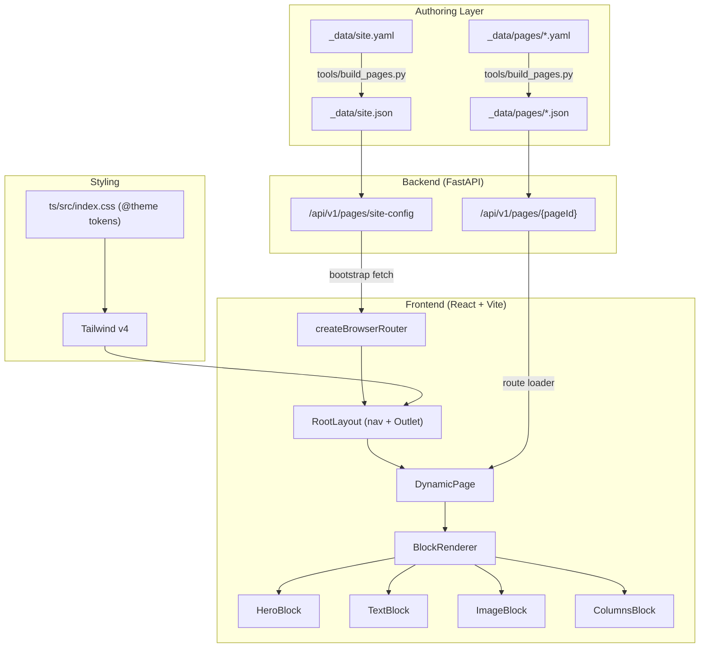

> Delivery is approved in phases. The [accepted user choices](../../08-governance/GOV-003-backlog-decisions.md) resolve conflicting details below; the [session backlog](../../09-backlog/README.md) tracks execution and completion. This document is a design source, not evidence of implementation.

# Dynamic HTML Generation Website Tool — Overview

## Goal

Build a data-driven dynamic page rendering system for D-System. Configuration files define site structure, page content (as composable blocks), and theming. React renders pages by fetching config from FastAPI, which reads from `_data/pages/` JSON files. Authors write page configs in YAML; a deterministic build script converts them to JSON validated by JSON Schema.

## Decisions

| Decision | Choice | Rationale |
|---|---|---|
| Data pipeline | FastAPI-served (`/api/v1/pages/{pageId}`) | Single data pipeline; no parallel static-file system |
| Config location | `_data/pages/` | Consistent with existing `_data/` entities |
| Entry point | Merge into existing `App.tsx` → `RouterProvider` | One entry point, no parallel app |
| Styling | Tailwind CSS v4 (CSS-first `@theme`) | Fast prototyping, consistent design system |
| Authoring format | YAML → JSON via `tools/build_pages.py` | YAML for readability + comments; JSON for consumption |
| Router | `createBrowserRouter` (React Router 6.4+ data API) | Route-level loaders, error boundaries, pending states |

## Architecture

```mermaid
graph TD
    subgraph "Authoring Layer"
        Y["_data/pages/*.yaml"] -->|"tools/build_pages.py"| J["_data/pages/*.json"]
        SC["_data/site.yaml"] -->|"tools/build_pages.py"| SJ["_data/site.json"]
    end

    subgraph "Backend (FastAPI)"
        SJ --> API["/api/v1/pages/site-config"]
        J --> API2["/api/v1/pages/{pageId}"]
    end

    subgraph "Frontend (React + Vite)"
        API -->|"bootstrap fetch"| BR["createBrowserRouter"]
        BR --> RL["RootLayout (nav + Outlet)"]
        RL --> PR["DynamicPage"]
        API2 -->|"route loader"| PR
        PR --> BLR["BlockRenderer"]
        BLR --> HC["HeroBlock"]
        BLR --> TC["TextBlock"]
        BLR --> IC["ImageBlock"]
        BLR --> CC["ColumnsBlock"]
    end

    subgraph "Styling"
        TH["ts/src/index.css (@theme tokens)"] --> TW["Tailwind v4"]
        TW --> RL
    end
```

## File Manifest

| Action | File | Layer | Plan Doc |
|---|---|---|---|
| NEW | `tools/build_pages.py` | Build tool | [PLAN-003.01-build-tooling.md](PLAN-003.01-build-tooling.md) |
| NEW | `schemas/site.schema.json` | Schema | [PLAN-003.01-build-tooling.md](PLAN-003.01-build-tooling.md) |
| NEW | `schemas/page.schema.json` | Schema | [PLAN-003.01-build-tooling.md](PLAN-003.01-build-tooling.md) |
| NEW | `_data/site.yaml` | Data | [PLAN-003.05-sample-data.md](PLAN-003.05-sample-data.md) |
| NEW | `_data/pages/home.yaml` | Data | [PLAN-003.05-sample-data.md](PLAN-003.05-sample-data.md) |
| NEW | `_data/pages/about.yaml` | Data | [PLAN-003.05-sample-data.md](PLAN-003.05-sample-data.md) |
| NEW | `src/models/pages.py` | Backend | [PLAN-003.02-backend.md](PLAN-003.02-backend.md) |
| NEW | `src/api/routes/pages.py` | Backend | [PLAN-003.02-backend.md](PLAN-003.02-backend.md) |
| MODIFY | `src/api/__init__.py` | Backend | [PLAN-003.02-backend.md](PLAN-003.02-backend.md) |
| MODIFY | `pyproject.toml` | Backend | [PLAN-003.02-backend.md](PLAN-003.02-backend.md) |
| MODIFY | `ts/vite.config.ts` | Frontend | [PLAN-003.03-frontend-setup.md](PLAN-003.03-frontend-setup.md) |
| NEW | `ts/src/index.css` | Frontend | [PLAN-003.03-frontend-setup.md](PLAN-003.03-frontend-setup.md) |
| NEW | `ts/src/types/schema.ts` | Frontend | [PLAN-003.04-frontend-components.md](PLAN-003.04-frontend-components.md) |
| MODIFY | `ts/src/main.tsx` | Frontend | [PLAN-003.03-frontend-setup.md](PLAN-003.03-frontend-setup.md) |
| NEW | `ts/src/router.tsx` | Frontend | [PLAN-003.03-frontend-setup.md](PLAN-003.03-frontend-setup.md) |
| NEW | `ts/src/layouts/RootLayout.tsx` | Frontend | [PLAN-003.04-frontend-components.md](PLAN-003.04-frontend-components.md) |
| NEW | `ts/src/pages/DynamicPage.tsx` | Frontend | [PLAN-003.04-frontend-components.md](PLAN-003.04-frontend-components.md) |
| NEW | `ts/src/pages/NotFoundPage.tsx` | Frontend | [PLAN-003.04-frontend-components.md](PLAN-003.04-frontend-components.md) |
| NEW | `ts/src/components/ErrorBoundary.tsx` | Frontend | [PLAN-003.04-frontend-components.md](PLAN-003.04-frontend-components.md) |
| NEW | `ts/src/components/BlockRenderer.tsx` | Frontend | [PLAN-003.04-frontend-components.md](PLAN-003.04-frontend-components.md) |
| NEW | `ts/src/components/blocks/HeroBlock.tsx` | Frontend | [PLAN-003.04-frontend-components.md](PLAN-003.04-frontend-components.md) |
| NEW | `ts/src/components/blocks/TextBlock.tsx` | Frontend | [PLAN-003.04-frontend-components.md](PLAN-003.04-frontend-components.md) |
| NEW | `ts/src/components/blocks/ImageBlock.tsx` | Frontend | [PLAN-003.04-frontend-components.md](PLAN-003.04-frontend-components.md) |
| NEW | `ts/src/components/blocks/ColumnsBlock.tsx` | Frontend | [PLAN-003.04-frontend-components.md](PLAN-003.04-frontend-components.md) |
| DELETE | `ts/src/App.tsx` | Frontend | [PLAN-003.03-frontend-setup.md](PLAN-003.03-frontend-setup.md) |
| MODIFY | `ts/package.json` | Frontend | [PLAN-003.03-frontend-setup.md](PLAN-003.03-frontend-setup.md) |

## Plan Documents

| Doc | Focus |
|---|---|
| [PLAN-003.01-build-tooling.md](PLAN-003.01-build-tooling.md) | YAML→JSON converter, JSON Schemas |
| [PLAN-003.02-backend.md](PLAN-003.02-backend.md) | Pydantic models, FastAPI endpoints, dependency changes |
| [PLAN-003.03-frontend-setup.md](PLAN-003.03-frontend-setup.md) | npm deps, Tailwind v4, Vite config, router, main.tsx |
| [PLAN-003.04-frontend-components.md](PLAN-003.04-frontend-components.md) | TypeScript types, layout, pages, error boundary, block components |
| [PLAN-003.05-sample-data.md](PLAN-003.05-sample-data.md) | YAML data files (site config, home page, about page) |
| [PLAN-003.06-verification.md](PLAN-003.06-verification.md) | Automated test commands, manual verification checklist |

## Pre-implementation adversarial review

The [2026-09-05 audit](../../07-architecture/ARCH-003-html-adversarial-audit.md)
records reproduced defects in the example contracts/converter and proposed changes to
phase sequencing, publication, routing and verification. Review its amendments before
implementing the examples. Findings are linked from every HTML backlog phase; the
recommendations remain proposals and do not change phase status or accepted product scope.

## Audit disposition (`phase-des-01`, 2026-10-04)

This plan is deprecated. On 2026-10-04 the owner retired the authored YAML content site that `PLAN-003` describes; [ADR-027](../../04-decisions/ADR-027-retire-plan-003.md) records the decision and what it leaves behind. Every requirement this document states is listed below with its disposition, as `REQ-021` R01 requires. Line numbers refer to this document above this section. An accomplished or superseded row names the shipped work, by file and commit or phase (`REQ-021` R03); a retired row gives the reason nothing will be built.

40 requirements: 1 accomplished, 5 superseded, 34 retired.

| Id | Line | Requirement | Disposition | Evidence or reason |
|---|---|---|---|---|
| 00-R1 | 16 | GOV-003's accepted choices resolve conflicting details; the backlog tracks execution | retired | The plan is retired, so there is nothing left to reconcile; the authored YAML content site is retired (ADR-027) |
| 00-R2 | 22 | A data-driven page system: configuration defines site structure, block content and theming | superseded | Generated pages come from repository data instead of authored configuration: static generated pages: `tools/generate_overview.py` (182fefa, `phase-demo-04`) and `tools/generate_engine_pages.py` (1913f26, `phase-des-09`), shown in the workbench by `ts/src/stage/HtmlViewerRegion.tsx` (3d24e5d, `phase-wb-04`) |
| 00-R3 | 22 | React fetches page configuration from FastAPI, which reads `_data/pages/` JSON | superseded | Pages are generated ahead of time and viewed as files: static generated pages: `tools/generate_overview.py` (182fefa, `phase-demo-04`) and `tools/generate_engine_pages.py` (1913f26, `phase-des-09`), shown in the workbench by `ts/src/stage/HtmlViewerRegion.tsx` (3d24e5d, `phase-wb-04`) |
| 00-R4 | 22 | Authors write YAML; a deterministic build script converts it to JSON validated by JSON Schema | retired | the authored YAML content site is retired (ADR-027) |
| 00-D1 | 28 | Decision: data pipeline served by FastAPI at `/api/v1/pages/{pageId}` | retired | no `/api/v1/pages` backend will exist (ADR-027) |
| 00-D2 | 29 | Decision: configuration lives in `_data/pages/` | retired | the authored YAML content site is retired (ADR-027) |
| 00-D3 | 30 | Decision: merge into the existing `App.tsx` and mount `RouterProvider` | retired | `ts/src/App.tsx` now renders the stage (b30b685, `phase-demo-02`); the React app has no URL routing; it is the demo stage and workbench (ADR-027) |
| 00-D4 | 31 | Decision: Tailwind CSS v4 with CSS-first `@theme` | superseded | Design tokens for generated pages: `templates/styles/house-tokens.json` and the generated `templates/styles/house.css` (49b0ca2, `phase-des-07`) |
| 00-D5 | 32 | Decision: YAML to JSON through `tools/build_pages.py` | retired | the authored YAML content site is retired (ADR-027) |
| 00-D6 | 33 | Decision: `createBrowserRouter` (React Router 6.4+ data API) | retired | the React app has no URL routing; it is the demo stage and workbench (ADR-027) |
| 00-A1 | 40-54 | Architecture: site-config bootstrap, `RootLayout`, `DynamicPage`, `BlockRenderer` | retired | the authored YAML content site is retired (ADR-027); the React app has no URL routing; it is the demo stage and workbench (ADR-027) |
| 00-A2 | 55-58 | Four block types: Hero, Text, Image, Columns | retired | the authored YAML content site is retired (ADR-027). Generated pages compose the house components in `templates/html/house-components.html` (49b0ca2) instead |
| 00-A3 | 62 | Theme tokens in `ts/src/index.css` | superseded | `templates/styles/house-tokens.json` and the generated `templates/styles/house.css` (49b0ca2, `phase-des-07`) |
| 00-M1 | 71 | NEW `tools/build_pages.py` | retired | the authored YAML content site is retired (ADR-027) |
| 00-M2 | 72 | NEW `schemas/site.schema.json` | retired | the authored YAML content site is retired (ADR-027) |
| 00-M3 | 73 | NEW `schemas/page.schema.json` | retired | the authored YAML content site is retired (ADR-027) |
| 00-M4 | 74 | NEW `_data/site.yaml` | retired | the authored YAML content site is retired (ADR-027) |
| 00-M5 | 75 | NEW `_data/pages/home.yaml` | retired | the authored YAML content site is retired (ADR-027) |
| 00-M6 | 76 | NEW `_data/pages/about.yaml` | retired | the authored YAML content site is retired (ADR-027) |
| 00-M7 | 77 | NEW `src/models/pages.py` | retired | no `/api/v1/pages` backend will exist (ADR-027) |
| 00-M8 | 78 | NEW `src/api/routes/pages.py` | retired | no `/api/v1/pages` backend will exist (ADR-027) |
| 00-M9 | 79 | MODIFY `src/api/__init__.py` to register the pages router | retired | no `/api/v1/pages` backend will exist (ADR-027) |
| 00-M10 | 80 | MODIFY `pyproject.toml` (add PyYAML) | accomplished | `pyproject.toml` line 17, `pyyaml>=6.0`, present since the initial commit b2b564b. No `phase-html-*` phase delivered it; the generators and governance check use it |
| 00-M11 | 81 | MODIFY `ts/vite.config.ts` to add the Tailwind plugin | retired | Tailwind is not adopted; generated pages use the house tokens (ADR-027) |
| 00-M12 | 82 | NEW `ts/src/index.css` | superseded | `templates/styles/house-tokens.json` and the generated `templates/styles/house.css` (49b0ca2, `phase-des-07`) |
| 00-M13 | 83 | NEW `ts/src/types/schema.ts` | retired | the authored YAML content site is retired (ADR-027) |
| 00-M14 | 84 | MODIFY `ts/src/main.tsx` to mount the router | retired | `ts/src/main.tsx` mounts `App`, which renders the stage (b30b685); the React app has no URL routing; it is the demo stage and workbench (ADR-027) |
| 00-M15 | 85 | NEW `ts/src/router.tsx` | retired | the React app has no URL routing; it is the demo stage and workbench (ADR-027) |
| 00-M16 | 86 | NEW `ts/src/layouts/RootLayout.tsx` | retired | the React app has no URL routing; it is the demo stage and workbench (ADR-027) |
| 00-M17 | 87 | NEW `ts/src/pages/DynamicPage.tsx` | retired | the authored YAML content site is retired (ADR-027) |
| 00-M18 | 88 | NEW `ts/src/pages/NotFoundPage.tsx` | retired | the React app has no URL routing; it is the demo stage and workbench (ADR-027) |
| 00-M19 | 89 | NEW `ts/src/components/ErrorBoundary.tsx` | retired | the authored YAML content site is retired (ADR-027). The stage's own lack of an error boundary is idea 000569 |
| 00-M20 | 90 | NEW `ts/src/components/BlockRenderer.tsx` | retired | the authored YAML content site is retired (ADR-027) |
| 00-M21 | 91 | NEW `ts/src/components/blocks/HeroBlock.tsx` | retired | the authored YAML content site is retired (ADR-027) |
| 00-M22 | 92 | NEW `ts/src/components/blocks/TextBlock.tsx` | retired | the authored YAML content site is retired (ADR-027) |
| 00-M23 | 93 | NEW `ts/src/components/blocks/ImageBlock.tsx` | retired | the authored YAML content site is retired (ADR-027) |
| 00-M24 | 94 | NEW `ts/src/components/blocks/ColumnsBlock.tsx` | retired | the authored YAML content site is retired (ADR-027) |
| 00-M25 | 95 | DELETE `ts/src/App.tsx` | retired | `ts/src/App.tsx` is the live stage entry (b30b685) and `sys-ui` evidence; deleting it would remove the demo stage |
| 00-M26 | 96 | MODIFY `ts/package.json` (router and Tailwind dependencies) | retired | the React app has no URL routing; it is the demo stage and workbench (ADR-027); Tailwind is not adopted; generated pages use the house tokens (ADR-027) |
| 00-R5 | 111-115 | Review ARCH-003's amendments before implementing | retired | Nothing will be implemented; ARCH-003's findings stand as the record of why the plan was not buildable as written |
