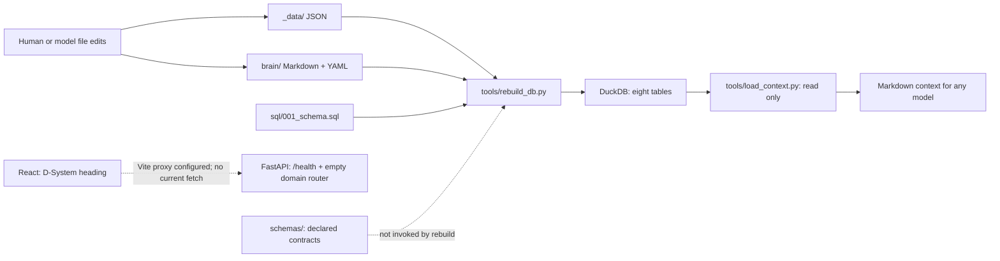

# D-System architectural and governance audit

**Audit date: 2026-09-05.** Baseline findings describe the repository before the governance implementation in this change. Source files and executable behavior take precedence over plans and narrative inventories. No private files or repository database were read or created.

## 1. Core synthesis

D-System is a **file-backed personal portfolio and shared-memory system with a disposable analytical projection**. Its useful implemented path is editing JSON/Markdown, rebuilding DuckDB, and retrieving memory as portable Markdown for a human or model. FastAPI and React provide an application shell. Reporting, generated pages, portfolio signals, and autonomous agent workflows are design intentions.

The central abstraction is a durable, reviewable source artifact with a stable ID. DuckDB is a projection boundary, not an authority boundary. JSON Schemas describe intended contracts, but the existing ingestion path does not enforce them. The system is currently operated by CLI and file edits, with manual synchronization and one maintainer implied by its conventions.

### Implemented topology

No runtime edge connects the current API to the database. `src/db/connection.py` exists but no domain route uses it. The governance checker added here separately reads public source metadata; it never passes through DuckDB or FastAPI.

### Load-bearing boundaries

| Boundary | Actual behavior and evidence | Consequence |
|---|---|---|
| Source → projection | [rebuild_db.py](../../tools/rebuild_db.py) reads tags, projects, people, commitments and memories; drops and recreates tables from [DDL](../../sql/001_schema.sql) | All direct DB edits disappear on rebuild; synchronization is manual |
| Nested tasks → relational rows | Commitment `tasks` array is unpacked; task project and creation date come from the commitment; list position becomes `sort_order` | Task identity must be unique across commitments; there is no separate task source file |
| Tags → duplicated query shapes | Project tags populate both the `projects.tags` array and `project_tags` junction | Loader consistency is the only mechanism keeping these representations aligned |
| People → project membership | `people[].projects` populates `project_people`; project `stakeholders` is allowed by schema but ignored by the loader | Two declared membership representations can disagree; the effective SQL source is the person's project list |
| Memory → query record | `_parse_memory` loads YAML fields, adds Markdown `content` and relative `file_path`; `index.md` is skipped | Front matter and stable IDs are ingestion contracts, not decorative metadata |
| Query → model context | [load_context.py](../../tools/load_context.py) opens read-only DuckDB and formats matching rows | Output is model-independent; no provider API, embeddings or agent runtime is involved |
| Application shell | [main.py](../../src/main.py), [router](../../src/api/__init__.py), [App.tsx](../../ts/src/App.tsx) | Only health is implemented; models and domain routes are absent |

The retrieval CLI combines title/body `LOWER(...) LIKE LOWER(?)`, type and project filters, and **all** requested tags using `AND`. A project query includes SQL `project_id IS NULL` globals, not every row marked `scope: global`. Existing memories use `project: d-system`, so querying another project excludes those repository memories despite their global scope. Ranking is confidence then creation date, not semantic relevance or last update. `--all` bypasses filters but still honors the default limit of 10. These are implemented behaviors, not the multi-stage Librarian described in the plan.

### Source inventory and runtime evidence

| Domain | Source contract | Derived tables | Observed records |
|---|---|---|---|
| Projects | `_data/projects/*.json`, project schema | `projects`, `project_tags` | 33 projects |
| Tags | `_data/tags.json`, tag schema | `tags` | 28 tags |
| People | `_data/people/*.json`, person schema | `people`, `project_people` | 0 people |
| Commitments/tasks | `_data/commitments/*.json`, commitment schema | `commitments`, `tasks` | 0 commitments, 0 tasks |
| Memory | `brain/**/*.md`, memory schema | `memories` | 7 memories |

These are a dated source/temporary-rebuild snapshot, not claims about the user's persistent database. Current project JSON passed its existing Draft-07 schema with date checking. People and commitments had no records to validate. Two isolated rebuilds under `/tmp` produced the same reported row counts, and keyword context retrieval returned the expected JSON-source memory. This verifies repeatability of the current inputs, not crash recovery, concurrency safety or complete schema equivalence. FastAPI OpenAPI contained only `/health`, whose response was `{"status": "ok"}`.

The governing Python requirement is `>=3.12` in [pyproject.toml](../../pyproject.toml), with Python 3.12 lint/type targets. README and memory references to 3.14 describe a particular environment, not a pinned portable requirement. The installed environment used for these checks is Python 3.14; the system `python3` is 3.13.13. Runtime dependencies are FastAPI, Uvicorn, DuckDB, Pydantic, pydantic-settings and PyYAML. Pydantic/settings are declared but no business models/settings layer is implemented. Frontend dependencies are React/React DOM; Router and Tailwind exist only in plans.

## 2. Plans versus code

| Plan or narrative | Intended capability | Ground truth and gap |
|---|---|---|
| [Dynamic HTML overview and six child plans](../01-plans/PLAN-003-dynamic-html-generation/PLAN-003-overview.md) | YAML pages → generated JSON → FastAPI → Router/layout/block renderer; Tailwind styling | No page/site schemas, converter, data files, routes, models or components exist. Plan includes concrete code, not installed implementation |
| [Mini systems](../01-plans/PLAN-002-mini-systems-proposal.md) | Six SQL signals and four synthesis tools | DDL contains eight tables and no views. Stale Radar can use current projects; accountability/velocity need real commitments and history |
| [Agent memory system](../01-plans/PLAN-001-agent-memory-system.md) | Vault Scribe, Chronicle, Librarian, contracts, embeddings, pruning | Markdown memory and basic CLI retrieval exist; role agents, candidate processing, vector search and pruning do not |
| [Artifact generation prompt](../02-prompts/PROMPT-001-artifact-code-generation-system.md) | Repeatable schema → model → route → tests → UI generation | A reusable instruction document, not an executable generator or verified scaffold |
| [Tag architecture](ARCH-001-tagging-system.md) | Stable, typed, related and deprecatable tag vocabulary | Tag registry and relational projection exist. The document's 27-tag table is stale against 28 source tags; no UI implements hiding deprecated choices |
| [Brain mini-systems concept](../../brain/concepts/mini-systems-architecture.md) | Describes SQL views as always live | A high-confidence memory describes a proposed topology; no views are implemented |

### Design tensions to resolve before implementation

1. **Generated JSON ownership:** the HTML plan introduces YAML authority plus generated JSON inside `_data/`, which is otherwise authoritative JSON. Define canonical files, ignored/committed generated outputs, stale-output detection and deletion behavior before building the converter. Its sample converter writes JSON but does not invoke the provided schemas despite the plan's validation claim.
2. **Contract strength:** the artifact prompt requires strict Draft-07 schemas; the HTML plan uses Draft 2020-12 and permissive backend block content. Pick a deliberate contract strategy and verify invalid block payloads at a boundary; frontend TypeScript cannot validate arbitrary runtime JSON.
3. **Membership authority:** resolve `project.stakeholders` versus `person.projects` before implementing a membership API. A schema-supported field is currently dropped by projection.
4. **Memory authority:** proposed sole-writer agent ownership conflicts with today's documented direct editing. Adopt such a workflow only with an explicit implemented contract; draft mandates are not current access controls.
5. **Retrieval semantics:** plan prose says current retrieval is keyword-only, while code already has tag/type/project filters. Proposed hint tags are absent from the tag registry. Thresholds for vector infrastructure in the plan are unmeasured assumptions, not repository findings.
6. **DB dependency injection:** the generation prompt proposes `Depends(get_db)` but `get_db` is a `@contextmanager` helper rather than a plain yielding FastAPI dependency. Verify and adapt the boundary before generating routes; do not treat the prompt as tested code.
7. **Snapshot ownership:** mini-system velocity snapshots proposed under `_data/snapshots/` need a decision about durable historical observations versus disposable derived exports. Live views would only be current relative to the last source rebuild.

## 3. Existing governance and implicit knowledge

| Convention already operating | Where it appears | What actually enforces it |
|---|---|---|
| Source files are authoritative, DB is disposable | README, CLAUDE, brain decision, loader | Loader behavior and `.gitignore`; writes to DB are not technically prohibited |
| Schema first; routes under `src/api/routes/`; imports through `src` | AGENTS, CLAUDE, artifact prompt | Instructions; no existing cross-layer consistency gate |
| Kebab file/record IDs, plural SQL names, composite junction keys | JSON, schemas, DDL | Partial schema/PK checks; no reference validator in rebuild |
| Memory has provenance/confidence/related IDs | Memory schema and seven entries | Loader accepts defaults and silently skips some malformed/no-ID entries |
| Tags have stable IDs and retirement flags | Tag schema and tagging guide | No deletion-history or new-use-of-deprecated-tag enforcement |
| Numbered documentation sections, dated plans and sessions | `docs/*/README.md` | Naming guidance only; enforced by governance since `PLAN-018` consolidated the legacy `plans/` location |
| ADRs for non-obvious decisions | AGENTS and decisions README | Convention; the existing source-of-truth rationale was stored as a brain decision |
| Python lint/types/tests and frontend build | [.github/workflows/ci.yaml](../../.github/workflows/ci.yaml) | CI exists; baseline Python test directory contained only a fixture and package marker |
| Private material stays separate | AGENTS, `.gitignore` | Explicit agent instruction and ignore rules; public audit did not access it |

Unwritten operating assumptions are a single coordinating writer, manual rebuilds after file edits, stable IDs across renames, root-relative server execution, small enough data for full rebuilds/scans, and humans resolving conflicts in model-produced context. These are viable at the present scale but should be named: a successful rebuild is not a concurrent-update or crash-safety guarantee. `src/db/connection.py` uses a working-directory-relative DB path while the scripts anchor their paths to the repository. Changing working directory can therefore select a different database.

## 4. Risks and ordered follow-up

| Priority | Evidence-backed gap | Smallest useful next change and acceptance |
|---|---|---|
| High | Rebuild drops tables before validating all source files; no explicit transaction or atomic publication; errors can leave a partial DB | Validate all sources and references before mutation, then define/test failure-safe publication; invalid source must leave the previous projection usable |
| High | DDL has no foreign keys; rebuild invokes no schemas; task IDs are globally keyed | Add source integrity checks for tags, people/projects, commitments and task IDs; fail with file/field diagnostics |
| Medium | API/UI capability overstatement in memory/plans | Use registry maturity and draft metadata; review prose when each capability actually ships |
| Medium | Memory globals and `--all` semantics differ from user expectations | Specify semantics and add focused retrieval tests with >10 memories and project/global cases |
| Medium | Existing CI lint fails on `typing.Generator` import in connection.py; loader scripts are outside current lint/type coverage | Make a focused lint repair and add meaningful loader/retrieval tests before broadening checks |
| Medium | Authority conflicts in HTML, membership and agent plans | Record ADRs at implementation time with acceptance cases; do not implement all roadmaps as part of governance |
| Low | Static counts and duplicated rules drift | Prefer generated inventory; retain dated snapshots and link shared instructions |

These are prioritized follow-up proposals, not automatically approved product work. Track them in the [reliability plan](../01-plans/PLAN-004-reliability-follow-up.md).

## 5. Governance deployed by this change

The [protocol](../08-governance/GOV-001-protocol.md) defines ownership, taxonomy, lifecycle, exact scope, review practices and enforcement limits. [ADR-001](../04-decisions/ADR-001-file-based-governance.md) explains separate document/memory schemas and keeping governance outside the database. [systems.yaml](../08-governance/systems.yaml) inventories 13 capabilities, including explicit scaffolds and proposed systems. Existing substantive plans receive metadata in place; their bodies and paths are retained.

`uv run python -m src.governance` validates document schemas, memory schemas, calendar dates, unique IDs, owners, references, paths, lifecycle consistency and dependency graphs. `--inventory` derives the open-plan list from source headers. CI invokes the same command. New tests exercise valid and invalid inputs using temporary repositories; operations and a reusable template make the protocol usable immediately.

Governance validation does not establish semantic truth, historical approval, all business-data validity or transactional rebuild safety. Those boundaries are explicit so a green check cannot be mistaken for a complete architecture guarantee.

### Verification of this governance implementation

| Check | Result |
|---|---|
| `uv run python -m src.governance` | Pass: 13 systems, 16 documents, 7 memories |
| `uv run pytest` | Pass: 32 tests; two pre-existing dependency deprecation warnings |
| `uv run mypy src/` | Pass: 8 source files |
| `uv run ruff check src/governance/ test/` | Pass |
| `uv run ruff check src/ test/` | Existing `UP035` failure in `src/db/connection.py:3`; unchanged |
| Isolated source rebuild and context retrieval | Pass: two temporary rebuilds and keyword retrieval |
| Frontend build | Not run; frontend implementation and dependencies unchanged |

The user's pre-existing README edit and execution prompt are preserved. The README's existing trailing whitespace is outside this change; other tracked diffs pass whitespace checks. No commit, remote publication, branch-protection change, or repository database mutation was performed.
