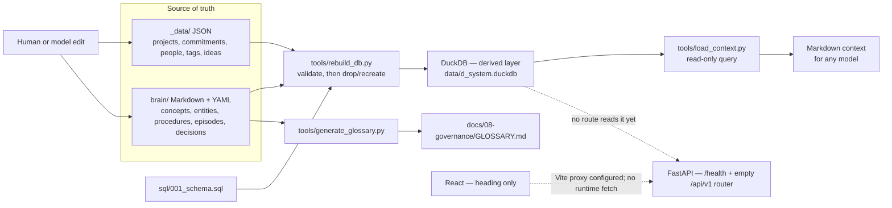

# D-System architecture overview

This is the document a new reader — human or model — should be given first. It describes the program
as it exists today: what it is for, what its subsystems are, how they depend on each other, and where
data flows. Per [PROMPT-004](../02-prompts/PROMPT-004-terminology-and-architecture.md), it **describes
only** — it does not decide whether the current shape is the right one. That question belongs to
[PROMPT-003](../02-prompts/PROMPT-003-systems-review.md) (systems review) and
[PROMPT-005](../02-prompts/PROMPT-005-governance-model-review.md) (governance model), and this
overview should be read before either, so their argument has a shared, accurate picture to argue
about.

Term definitions used throughout are canonical in `brain/concepts/terms-*.md` and rendered at
[GLOSSARY.md](../08-governance/GLOSSARY.md); this document does not redefine them.

For a dated, evidence-gathering audit rather than a standing overview, see
[ARCH-002](ARCH-002-system-audit.md). That document is a snapshot from 2026-09-05 and is not kept
current; this one is the maintained entry point.

## 1. What this is for

D-System is a personal consulting management system: it tracks people, projects, commitments and
tasks so that work responsibilities live in one place instead of the owner's head. It is also a
platform for generating HTML reports and pages from that data, and for triggering agentic workflows
against it. Two things are true about it structurally that shape everything below:

- **Every fact has exactly one authoritative home.** Business records live in `_data/` and durable
  memory lives in `brain/`, both as git-tracked, human-readable files. Anything else — the DuckDB
  database, the generated glossary, the generated catalog — is rebuilt from those files and is never
  itself edited.
- **The repository governs its own process, not just its product.** `docs/08-governance/` and
  `docs/09-backlog/` apply the same source-of-truth discipline to the work of building the system that
  `_data/` and `brain/` apply to the system's own subject matter.

## 2. Data flow

The rebuild is a full drop-and-recreate: every source file is validated first, and a validation
failure leaves the previous database untouched rather than writing a partial one. Nothing is ever
written back from DuckDB into `_data/` or `brain/` — the arrow only ever points one way. The generated
glossary follows the same one-way pattern from `brain/`'s `concept` memories, as does
`docs/08-governance/catalog.md` from document front matter.

## 3. Subsystems and their dependencies

One row per entry in [systems.yaml](../08-governance/systems.yaml), the authoritative registry. `→`
reads "depends on". A `planned` status means the row exists to reserve the shape and record intent;
it is not evidence the capability is built.

| System | Domain | Status | Depends on | What it does now | What it does not do yet |
|---|---|---|---|---|---|
| `sys-contracts` | data | implemented | — | Six JSON Schemas for project, person, commitment, tag, memory and idea, invoked by the source preflight before every rebuild | Does not check that references resolve — a tag or project ID can point at nothing, since the DDL has no foreign keys |
| `sys-portfolio` | data | implemented | → `sys-contracts` | Populated projects and tags; an append-only idea log | People and commitments have loader support but no source records yet |
| `sys-capture` | data | planned | → `sys-contracts`, `sys-portfolio` | Design documents for a raw-capture store and structuring pipeline | No intake path exists; nothing is implemented |
| `sys-brain` | memory | implemented | → `sys-contracts` | Human- and model-authored memories (concept, entity, procedure, episode, decision), each optionally tagged to a `system` for scoped retrieval | No dedicated writer agent, automated promotion, conflict resolution or review trigger |
| `sys-projection` | data | implemented | → `sys-portfolio`, `sys-brain` | A full drop/recreate loader building the DuckDB tables from `_data/` and `brain/` | No atomic publication or automatic synchronization — a rebuild is manual and all-or-nothing |
| `sys-retrieval` | memory | implemented | → `sys-projection` | Read-only keyword, project, type, tag and system filtering over DuckDB memories, ordered by confidence then recency | No embeddings, no semantic ranking, no agent router |
| `sys-api` | application | scaffold | — | A health endpoint, CORS and an empty `/api/v1` router | No domain route reads the database; nothing under `src/api/routes/` yet |
| `sys-ui` | application | scaffold | — | A heading-only React app with a Vite dev proxy to the API | No runtime API request is made from the frontend |
| `sys-html` | application | planned | → `sys-api`, `sys-ui`, `sys-contracts` | A design for YAML-authored pages compiled to JSON, served through the API and rendered by React | Templates are placeholders; no converter, route or component exists |
| `sys-signals` | data | planned | → `sys-projection` | A design for six SQL-computable portfolio signals | No SQL view exists |
| `sys-synthesis` | application | planned | → `sys-signals` | A design for context packs, briefings, weekly review and a portfolio digest | No generator exists |
| `sys-memory-agents` | memory | planned | → `sys-retrieval` | Proposed Vault Scribe, Chronicle and Librarian roles | No agent, vector store or pruning tool is implemented |
| `sys-delivery` | delivery | implemented | — | Python lint/type/test and frontend build CI jobs, plus the governance gate | `tools/` scripts are not yet covered by the documented lint gate (`phase-rel-09`); no deploy or release job |
| `sys-governance` | governance | implemented | — | Document and memory front-matter checks, a per-kind code register, and a derived plan inventory | Does not verify that a plan's claims are true, run tests, rebuild the database, or check every business JSON file |
| `sys-backlog` | governance | implemented | → `sys-governance` | One-session phases with dependencies, derived readiness, and bounded concurrent claims checked for disjoint systems/paths | Cannot see whether an agent's actual edits stayed inside a phase's declared boundaries — that is diff review, not the checker |
| `sys-course` | delivery | retired | — | Nothing — extracted to its own, independent repository | Kept as a retired registry entry rather than deleted, matching how other components are retired |

Two structural notes the table does not show on its own. First, the dependency graph has three roots
with nothing pointing into them from outside their own domain — `sys-contracts` (data),
`sys-api`/`sys-ui` (application) and `sys-delivery`/`sys-governance` (delivery/governance) — meaning
the application shell and the CI/governance machinery are presently independent of whether the data
layer or the memory layer changes shape. Second, every `planned` system depends on an `implemented`
one; nothing planned is waiting on another planned system, so there is no forward dependency chain
still to be resolved before work on any one of them could start.

## 4. Governance documents

Each governs what its name suggests; **mechanically enforced** means `uv run python -m src.governance`
or CI rejects a violation, **convention** means correctness depends on a human or model following the
document without a check behind it.

| Document | Governs | Enforcement |
|---|---|---|
| [GOV-001](../08-governance/GOV-001-protocol.md) | Front-matter contract, taxonomy/series table, lifecycle states, enforcement boundaries | Mechanically enforced (schema + validator) for shape, IDs, references and cycles; the lifecycle *transitions themselves* are convention, reviewed by the owner |
| [GOV-002](../08-governance/GOV-002-backlog-protocol.md) | Backlog field meanings, phase state machine, concurrency rules, session start/end procedure | Mechanically enforced for schema shape, dependency completeness and concurrent-claim disjointness; the *session procedure* (claim, worktree, rebase, handoff) is convention |
| [GOV-003](../08-governance/GOV-003-backlog-decisions.md) | Accepted answers to open plan questions, and the ledger of concurrency-collision resolutions | Convention — a record of decisions, not a checked rule |
| [GOV-004](../08-governance/GOV-004-backlog-capture.md) | Mapping from plan sections to backlog phases at initial capture | Convention — a review document, not re-run automatically |
| [GOV-005](../08-governance/GOV-005-document-codes.md) | Code series, allocation, reservation, retirement and permanence | Mechanically enforced — `--next-code`, reservation/retirement checks, duplicate-code and filename-prefix checks all run in the validator |
| [GOV-006](../08-governance/GOV-006-conversation-guidelines.md) | How agents report results and ask questions | Convention — no check reads conversational text |
| [OPS-001](../08-governance/OPS-001-operations.md) | Runbook: commands, failure-diagnostic table, session and claim mechanics | Convention — a procedure document; the commands it names are themselves mechanically checked, but following the runbook is not enforced |
| [codes.yaml](../08-governance/codes.yaml) | The code ledger: series, counters, reservations, retirements | Mechanically enforced — the single source `--next-code` and the validator both read |
| [systems.yaml](../08-governance/systems.yaml) | Component identity, owner, domain, status, paths, dependencies | Mechanically enforced for shape and reference integrity; whether a `status` value is actually true is a human judgment |
| [catalog.md](../08-governance/catalog.md) | Generated index of every document, code and phase state | Mechanically enforced — CI regenerates and diffs it; a stale catalog fails the build |
| The governance check itself (`uv run python -m src.governance`) | All of the above's machine-checkable half | Is the enforcement mechanism, not a governed document |

## 5. Tooling

Two scripts carry the data flow described in §2. Per-tool operations documents (trigger, expected
result, failure/recovery) are the subject of a later phase under
[PLAN-013](../01-plans/PLAN-013-tooling-documentation.md); this section describes only what exists
today, so that plan starts from an accurate base rather than pre-empting it.

**`tools/rebuild_db.py`** — reads every file under `_data/` and `brain/`. Validates all of them
against `schemas/` first; if any file fails, it prints the diagnostics and exits without writing
anything, so a bad source file costs nothing. If validation passes, it drops every table listed in its
drop order and recreates them from `sql/001_schema.sql`, loading projects, tags, people, commitments
(unpacking their embedded `tasks` array), memories, and ideas (folded from the append-only event log).
It writes only to `data/d_system.duckdb`, which is gitignored. Failure mode: a validation error is a
clean, described exit; a rebuild that is interrupted mid-write (not validation) can leave a
partially-loaded database, since there is no atomic publication step — the same gap `sys-projection`'s
registry entry names.

**`tools/load_context.py`** — reads only `data/d_system.duckdb`, read-only, and writes nothing. Takes
a query, project, type, tag list and/or system filter, and formats matching memory rows as Markdown
for any model to consume. Failure mode: if the database file does not exist, it returns a plain
message telling the caller to run `rebuild_db.py` first, rather than raising a raw connection error;
if the database exists but is stale relative to `brain/`, it silently returns stale results, because
it has no way to detect staleness on its own.

**`tools/generate_glossary.py`** — reads `brain/`'s `concept` memories directly (not through DuckDB)
and renders them into `docs/08-governance/GLOSSARY.md`, or a filtered slice to `--out` when given
`--tag`/`--system`. `--check` exits 1 if the committed file does not match a fresh render, which is
what `test_glossary.py` exercises. It writes only Markdown; it never touches `_data/`, `brain/` source
files, or the database.
