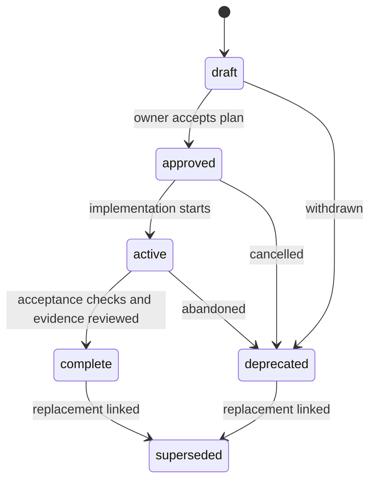

# Repository governance protocol

This repository is governed through versioned files and small checks. The owner edits a document, runs one validator, and reviews the resulting diff. A plan's existence never establishes that its feature exists.

Start with the [architectural audit](../07-architecture/ARCH-002-system-audit.md), the [component registry](systems.yaml), and the [operations guide](OPS-001-operations.md). The design choice is recorded in [ADR-001](../04-decisions/ADR-001-file-based-governance.md).

## Authority and ownership

| Question | Authoritative source |
|---|---|
| What works today? | Executable code plus observed verification; audit records a dated snapshot |
| What are the data shapes? | `schemas/`, followed by DDL, loaders, and eventual Pydantic models |
| What is the original business data? | Source JSON at the configured data root; never the derived database |
| What are the durable memory facts? | `brain/`, with provenance and confidence; verify mutable claims against code |
| Why was an architectural choice made? | Accepted ADR in `docs/04-decisions/` |
| What might we build? | Plan front matter and body; draft content is a proposal |
| Who maintains a capability? | `owners` and `systems` in `systems.yaml` |
| Which instructions apply to an agent? | User/session instructions and applicable `AGENTS.md`; plans do not override them |

`repository-owner` identifies the existing maintainer role. It does not claim a named person approved a document. Git records authorship; ownership records accountability. An AI model is an author or implementation tool, not a durable organizational owner. Add an owner key to the registry before using it.

`CLAUDE.md` remains a model-specific entry point. Shared conventions belong in `AGENTS.md` and this protocol; link to them instead of maintaining contradictory copies. `CLAUDE.md` states its own scope rule — pointers, immediately actionable instructions, and only those facts whose duplication is justified because being unaware of them for one turn causes irreversible harm. Current direct human/model editing of `brain/` continues. The proposed Vault Scribe monopoly is not an active access policy.

### The data root

`_data/` is the tracked default data root, not the owner's portfolio. [ADR-009](../04-decisions/ADR-009-structure-content-boundary.md) draws the line: structure is tracked, content is not, and the test for an unclear case is whether the file would still be correct if a different person adopted the system. Real records live at `D_SYSTEM_DATA_ROOT`, defaulting to `_data/`; the tracked tree holds a fictional portfolio that exercises every schema. A fresh clone with no environment set must pass the governance check, the tests and a rebuild — that constraint binds every phase of [PLAN-006](../01-plans/PLAN-006-confidentiality-sweep.md).

`phase-priv-03` completed the move: the owner's real records live at `_private/portfolio/` and the tracked `_data/` now holds only the fictional example set. Entity content (projects, people, commitments, tasks, ...) resolves through `data_root()` in `src/db/source_validation.py`, honouring `D_SYSTEM_DATA_ROOT`. `_data/tags.json` and `_data/ideas.jsonl` are shared taxonomy and process data, not portfolio content, and are always read from the tracked `_data/` regardless of the override.

## Taxonomy and placement

| Kind | Series | Canonical location | Body requirements |
|---|---|---|---|
| `plan` | `PLAN` | `docs/01-plans/PLAN-NNN-topic.md` or a `PLAN-NNN-topic/` folder | Outcome, scope, dependencies, steps, acceptance checks, open questions |
| `adr` | `ADR` | `docs/04-decisions/ADR-NNN-topic.md` | Context, decision, alternatives, consequences, revisit trigger |
| `architecture` | `ARCH` | `docs/07-architecture/ARCH-NNN-topic.md` | Current topology, evidence, constraints, explicit planned/implemented distinction |
| `requirement` | `REQ` | `docs/06-requirements/REQ-NNN-topic.md` | Observable requirement and verification method |
| `prompt` | `PROMPT` | `docs/02-prompts/PROMPT-NNN-topic.md` | Inputs, context, expected output, constraints; label embedded proposals |
| `session` | `SESS` | `docs/03-sessions/SESS-YYYY-MM-DD-NN-topic.md` | Dated outcomes, evidence, unresolved items |
| `walkthrough` | `WALK` | `docs/03-sessions/WALK-YYYY-MM-DD-NN-topic.md` | Reproducible steps, result, verification |
| `operation` | `OPS` | `docs/08-governance/OPS-NNN-topic.md` | Trigger, command, expected result, failure/recovery steps |
| `governance` | `GOV` | `docs/08-governance/GOV-NNN-topic.md` | Rules, scope, enforcement and exceptions |
| Brain memory types | — | Existing `brain/<plural-type>/` directories | Existing memory schema; no document lifecycle fields |

New durable memories go in `brain/`. `docs/05-memories/README.md` is a navigation pointer; it is not a competing memory store. All plans, including `PLAN-001`, live under `docs/01-plans/`; root `plans/` no longer exists (see [PLAN-018](../01-plans/PLAN-018-plans-directory-consolidation.md) and [GOV-003](GOV-003-backlog-decisions.md)). Multi-file plans give each child its own ID, a sub-code under the parent's code, and `parent` pointing at the overview. Codes are assigned with `--next-code` and are never chosen by hand; [GOV-005](GOV-005-document-codes.md) states the rules and [ADR-006](../04-decisions/ADR-006-document-codes.md) the rationale. `depends_on` means a prerequisite, not merely a related topic.

## Front matter contract

Every substantive Markdown file under `docs/` must satisfy [document.schema.json](../../schemas/document.schema.json). Every memory under `brain/` must satisfy [memory.schema.json](../../schemas/memory.schema.json). These are separate contracts because the memory loader and existing entries already depend on their current shape.

```yaml
---
schema_version: 1
id: doc-example-plan
code: PLAN-006
title: Example implementation plan
kind: plan
status: draft
owner: repository-owner
created: '2026-09-05'
updated: '2026-09-05'
systems: [sys-api]
depends_on: []
# parent: doc-parent-overview
# review_after: '2026-12-05'
# tags: [python]
---
```

| Field | Semantic rule |
|---|---|
| `schema_version` | Exactly `1`; contract changes require a migration decision |
| `id` | Stable `doc-` kebab ID, unique across governed documents; independent of path |
| `code` | Catalog code from the series for this kind, unique and permanent; must prefix the filename. Allocate with `--next-code`, never by hand |
| `title`, `kind` | Nonempty title and allowed kind; kind must match directory |
| `status` | Allowed state for that kind; see lifecycle below |
| `owner` | Existing registry owner key |
| `created`, `updated` | ISO calendar dates, `created <= updated <= today`; quote new dates for interoperability |
| `systems` | Unique existing `sys-` IDs; may be empty for genuinely cross-repository context |
| `depends_on` | Unique document IDs; no self references or cycles |
| `parent` | Optional plan-to-plan containment; no containment cycles |
| `supersedes` | Optional replaced document IDs; targets must have status `superseded`; no cycles |
| `completion_evidence` | Required nonempty file-path list for a complete plan; files must exist |
| `review_after` | Optional date; overdue review produces a warning, not a broken build |
| `tags` | Optional unique IDs from the data root's `tags.json`; classification does not replace ownership |

Unknown fields, duplicate YAML keys, malformed/non-mapping headers, invalid dates and empty bodies fail. Delimiters must occupy their own lines. Quoted and unquoted ISO dates are accepted. Schema defaults are descriptive and are not written back into files. Namespaces are distinct: `sys-*` components, `doc-*` documents, `mem-*` memories, and portfolio project IDs.

Memory `project: d-system` is preserved as an explicit repository-scope identifier; it does not create a portfolio project. Other memory project references must resolve to project records under the configured data root. Memory `related` links must resolve to memory IDs, and `scope: project` requires a project. Confidence is not a lifecycle state or proof that a feature is implemented.

## Lifecycle and review



This diagram describes plans. ADRs use `draft → accepted → deprecated/superseded`. Other documents use `draft → active → deprecated/superseded`. Drafts may be edited freely. For accepted ADRs, substantive decision reversals use a new ADR with `supersedes`; retain the old decision for historical interpretation.

The owner approves a concrete diff through the ordinary repository review process or records a direct local decision in Git history. A single-maintainer repository needs no committee, mandatory external message, or second approver. Existing task authorization remains valid. Marking metadata `approved` cannot manufacture approval: the reviewer checks the underlying decision. Completion means acceptance criteria were actually met; writing a plan or creating an empty evidence file is insufficient.

Before accepting or activating a document, check facts against cited source paths, clarify proposed versus current behavior, resolve dependencies, and run validation. On completion, link implementation and verification files in `completion_evidence` and summarize actual test results in the body. On cancellation, preserve the reason. On replacement, change the old status and the new `supersedes` list in the same diff. Several documents may replace different portions of a retired document; each must explain its scope.

The validator checks current-state consistency. Git review checks transition history, ID permanence, actual ownership consent, quality of evidence, and whether prerequisites are satisfied. It does not enforce historical transitions or semantic truth. Session records should be append-only after review; corrections are dated additions, subject to ordinary review.

## Inventory without duplicate bookkeeping

`systems.yaml` stores only component identity, owner, domain, maturity, existing evidence paths, dependencies, and a bounded responsibility. It is not a second project portfolio. Components are capabilities that can change independently; individual tables and files are described within their owning component. Domain categories group them without adding another dependency hierarchy.

```bash
uv run python -m src.governance
uv run python -m src.governance --inventory
```

The inventory is generated on demand from the registry and document headers. It includes all draft, approved and active plans, including child plans; no maintained plan list is committed. A generated file may be committed only when a check regenerates it and fails on any difference, as [catalog.md](catalog.md) does; the rule forbids hand-maintained duplicates, not mechanically verified ones. System maturity uses `implemented`, `scaffold`, `planned`, `retired`, independently of plan status. The registry's dependency graph describes current dependencies for implemented components and intended dependencies for planned components. Existing paths locate a capability; a plan path is not implementation evidence. Review that distinction before changing maturity.

## Enforcement and adoption boundaries

| Check | Mechanism | Result |
|---|---|---|
| Metadata shape, calendar dates and extra fields | Draft-07 schemas + format checker | CI failure |
| IDs, owners, tag/project/memory/system/document references | Python validator | CI failure |
| Dependency, parent and supersession cycles | Graph checks | CI failure |
| Overlapping or unclaimed concurrent active phases | Backlog concurrency check | CI failure |
| Work that strays outside a phase's declared systems/deliverables | Owner's diff review | Human decision |
| Missing component/evidence paths; protected or symlink paths | Read-only path checks | CI failure |
| Overdue review date | Date check | Warning |
| New governed Markdown missing metadata | Explicit root scanning; no legacy content allowlist | CI failure |
| Approval, permanence, meaningful evidence, prose accuracy | Owner's diff review | Human decision |
| Python and frontend quality | Existing CI jobs | Existing check behavior |

Only the exact navigation files listed in `src/governance/__main__.py:EXEMPT` and `docs/02-prompts/codex_governance_prompt.md` are exempt in the scanned roots. The latter is the user's execution input, not a managed implementation plan. Arbitrarily naming a new file `README.md` does not exempt it. Root entry points (`README.md`, `AGENTS.md`, `CLAUDE.md`), `js/`, templates, `_working/` and `_public/` are outside metadata scanning. Promote durable scratch work into a governed directory before relying on it. Template examples contain placeholders and are intentionally outside scanning.

The checker reads only known public source locations, does not traverse `_private/`, and never opens or creates `data/`. It does not rebuild the database, validate all business JSON, check every Markdown hyperlink, infer undocumented components, or contact external services. Existing JSON Schema files are locally loaded; their `$schema` URLs do not require network calls. CI runs the validator after development dependency installation. Enforcing CI as a protected-branch merge requirement is repository-host configuration, not changed by this implementation.

For a normal change: update the relevant code/docs; update the component registry only if responsibility, maturity, paths, ownership or dependencies changed; run checks; review one focused diff. Review overdue items during the existing weekly review habit, and reassess component maturity when a plan completes. Do not add a scheduler or a service until manual use establishes a need.

## Session backlog extension

[ADR-002](../04-decisions/ADR-002-session-backlog.md) adds an authoritative phase catalog in
`docs/09-backlog/backlog.yaml`. This stores execution state; parent plan documents retain
design context. The [backlog protocol](GOV-002-backlog-protocol.md) governs session sizing, dependencies,
readiness and completion. Open-plan coverage is checked by the default governance command.
The catalog and metadata still require no DuckDB or external service.

`docs/09-backlog/README.md` is an explicitly exempt navigation file. The user's original
`docs/00-working/codex-answers.md` is an explicitly exempt raw input, with its choices
formalized in [the decision record](GOV-003-backlog-decisions.md). Other new Markdown files under
`docs/00-working/` do not receive an automatic exemption.

## Concurrent agent execution

[ADR-003](../04-decisions/ADR-003-multi-agent-concurrency.md) amends ADR-002's single-active rule.
Several agents may hold phases at once, bounded by `max_active` in the catalog and by pairwise
disjoint `systems`, disjoint `deliverables` paths and no transitive dependency link. Each active
phase names its `agent`; one agent holds one phase.

The catalog on `dev` — the integration branch — is the lock table and the governance command is the
lock check, so a claim is committed to `dev` before work begins rather than held on the agent's own
branch. Whenever a peer holds an active claim or the phase touches `src/`, `ts/`, `schemas/`,
`sql/`, `tools/` or `test/`, work happens in a
`git worktree` on `agent/<phase-id>`, checked out at `../d-system-worktrees/<phase-id>` — outside the
repository directory, so no scanner, linter or test run ever walks a second copy of the tree. A solo
agent on a documentation- or skill-only phase, with no peer claim and no deliverable outside `docs/`
or `.claude/`, may instead work directly in the primary checkout on `dev` (see
[GOV-003](GOV-003-backlog-decisions.md)). `_worktrees/` is gitignored as a guard against a misplaced
worktree, not as a second sanctioned location. Integration requires the full check to pass *after*
rebasing onto current `dev`.

This adds no scheduler, agent registry, service or lock daemon. Agent identities are ephemeral
claim labels validated by pattern and uniqueness; they are not registry owners, and `repository-owner`
remains the accountable role for every phase regardless of which agent executed it. The
[backlog protocol](GOV-002-backlog-protocol.md) states the rules and [AGENTS.md](../../AGENTS.md) the
operational steps.
