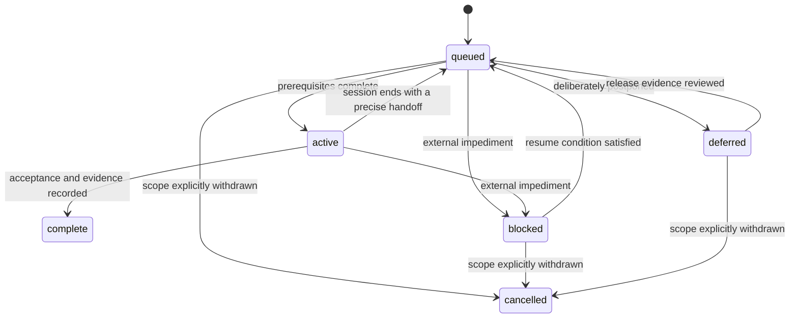

# Session backlog planning and execution protocol

The [backlog](../09-backlog/backlog.yaml) is the execution record for all open plans. Each item is **one phase with one independently verifiable outcome that fits one focused session**, including implementation, relevant checks and a handoff. Parent plans retain the broader design and acceptance context. The backlog has its own strict [schema](../../schemas/backlog.schema.json); it is development metadata and is not loaded into DuckDB.

## Read the queue

```bash
uv run python -m src.governance            # docs, memories, backlog and full plan coverage
uv run python -m src.governance --ready    # eligible phases, ordered by priority then stable ID
uv run python -m src.governance --backlog  # all phases, coverage table and complete phase details
uv run python -m src.governance --inventory
```

Reports are generated on stdout. Edit YAML state, not a second board or manually copied report. `--ready` shows eligibility, the phases currently claimed by other agents, and a **Conflicts** column naming any active phase a candidate would collide with. The commands are read-only and do not start work, change state, call models, open DuckDB or create `data/`.

## Every item carries its session contract

| Field | Meaning |
|---|---|
| `id` | Permanent `phase-<track>-NN` ID; insertions do not renumber existing work |
| `title` | One observable outcome; an implementation or decision phase can both be useful |
| `plan`, `sources` | One primary plan plus all other governed source IDs covered by the phase |
| `systems`, `owner` | Existing component IDs and accountable owner key |
| `priority` | 1: foundations; 2: capabilities; 3: composition; 4: conditional extensions |
| `next_up` | Catalog-level ordered list of phase IDs that jump the queue; the front of the backlog |
| `session_budget` | Exactly `1`; a review promise about scope, not an automatic timing guarantee |
| `depends_on` | Phase prerequisites; all must be complete before starting/completing the phase |
| `scope` | Concrete steps bounded to this outcome |
| `acceptance` | At least two observable completion conditions |
| `verification` | Commands or specific review/experiment checks; run and record results during execution |
| `deliverables` | Expected paths, which may not exist yet; update proposed filenames at execution when needed |
| `next_action` | First useful action for the next session or a precise resume instruction |
| `status` | Stored execution state; readiness is derived |
| `agent` | Claim identity `agent-<name>`; names the branch `agent/<phase-id>`; required on every active phase while `max_active` exceeds 1 |
| `blocked_reason`, `resume_when` | Explanation and release condition for blocked/deferred work |
| `session`, `completion_evidence`, `result` | Governed session ID, existing evidence files and actual results; required together for `complete`, and may already be recorded incrementally while the phase is `active` or `blocked` — a checkpoint on a long or complex session records real interim evidence rather than waiting for close |

Expected session-record filenames in initial deliverables are illustrative; use the real execution date when writing a record. Future ADR filenames are proposed, not reservations that override later repository work. Source IDs remain stable even when a file moves.

A phase that has released its claim — `queued`, `deferred` or `cancelled` — carries none of the three: nobody holds the phase, so there is no interim work left to have evidence of.

## State and dependency rules



A queued phase displays as **ready** when every dependency is complete and **waiting** otherwise. Blocked/deferred are explicit decisions, not synonyms for an unmet ordinary prerequisite. Completed prerequisites are required for both active and completed states. A cancelled dependency does not silently satisfy its dependents: revise the plan/dependency graph deliberately.

Completing a phase requires a real session/walkthrough document, existing evidence paths, and a verification-result summary. The checker cannot decide whether code is correct, evidence is persuasive, or a phase truly fits a session; diff review verifies those facts. Metadata changes do not manufacture approval.

## Concurrent phases

The optional top-level `max_active` bounds simultaneous claims; it defaults to `1`, and this repository sets `3`. Raising the cap does not by itself authorize two phases to run together. Every pair of active phases must additionally be disjoint in all three respects checked by [`inspect_backlog`](../../src/governance/backlog.py):

| Rule | Rejected pair |
|---|---|
| Disjoint `systems` | Both phases name the same `sys-*` ID |
| Disjoint `deliverables` | A declared path in one equals or contains a declared path in the other |
| No dependency link | One phase is a transitive prerequisite of the other |

Each active phase names its `agent`, one active phase per agent, and a phase released back to `queued`, `deferred` or `cancelled` must drop that field. `active`, `blocked` and `complete` keep it: a blocked phase still owns a worktree, and a complete phase records who did the work. [ADR-003](../04-decisions/ADR-003-multi-agent-concurrency.md) states the model, and [AGENTS.md](../../AGENTS.md) carries the operational steps.

Two things are deliberately not machine-checked. A phase that edits files outside its declared `systems` and `deliverables` defeats the disjointness rule entirely — the declarations are what the validator can see, and diff review is what confirms the work stayed inside them. Adjacency in the `systems.yaml` dependency graph is also unchecked: an agent working a system that `depends_on` a peer's active system must treat the upstream contract as frozen at the commit it branched from and build against merged `main`, never against a peer's branch.

### The stale-claim signal

`--ready` and `--backlog` both add a **Stale?** column to the active-claims table
(`phase-conc-01`, `REQ-013` R01–R03). It reports, per active phase, one of three text
states rendered by [`claim_report_state`](../../src/governance/backlog.py) — never a
verdict, only what the check could see:

| State | Meaning |
|---|---|
| `no` | Both mechanical signals were evaluated and neither fired. |
| `STALE: <signal>` | A signal fired, naming which one: `no commit on its branch in Nd (> 2d)`, or `worktree missing`. |
| `no evidence: no agent/<phase-id> branch found` | The branch `agent/<phase-id>` has no commits to read at all, so neither signal could be evaluated. This is also the state a claim shows when its real branch does not follow the `agent/<phase-id>` naming convention this check assumes — the check has nothing wrong to report, and nothing confirmed clean either. |
| `no signal evaluated` | This run gathered no git evidence for the phase at all (a caller that never wired up [`git_claim_evidence`](../../src/governance/__main__.py)). |

The two signals [`stale_claim_signal`](../../src/governance/backlog.py) evaluates are
mechanical, not judgement calls:

- **Branch commit recency** — days since the most recent commit on `agent/<phase-id>`,
  fires past `STALE_CLAIM_DAYS` (`2`, set from this repository's own history: of 17
  claim-to-completion pairs on `dev` measured 2026-09-19, the longest gap was 1 day and
  most closed the same day; the threshold is double that observed maximum).
- **Worktree presence** — whether `git worktree list` currently shows a worktree checked
  out on `agent/<phase-id>`; its absence fires the signal.

**What the signal does not prove** (`REQ-013` R02): it is evidence for the owner, never
proof the agent is dead. A session reading, thinking, or blocked on external input for
longer than the threshold produces the identical reading to an abandoned one. A missing
worktree read from a machine that never held it is not evidence at all — worktree
directories are local filesystem state, not replicated by git. And a claim whose branch
does not exist yet is reported as `no evidence`, never as stale: "claimed a moment ago" and
"abandoned before starting" produce the same absence, and only a person can tell them
apart.

**The report is an input to a human decision, and releases nothing.** No code under
`src/governance/` writes `status: queued` over another agent's claim — `REQ-013` R03's
negative half, checked by grep in `test/test_backlog.py`. The authorized recovery
procedure that *does* release a stale claim is `phase-conc-04`'s, written into
[GOV-003](GOV-003-backlog-decisions.md); it consumes this signal as evidence rather than
re-deriving staleness.

## Capture before implementation

1. Read all open plans and the accepted decision record. Find existing phases before creating duplicates.
2. Split each plan into one-outcome phases with explicit acceptance checks and dependencies. Shared prerequisites have one phase referenced by all affected sources.
3. Cover every overview **and** child plan in `plan`/`sources`. CI fails if any draft, approved or active plan has no non-cancelled phase.
4. Include postponed work with a reason and release condition. A deferred phase is still inventoried.
5. Run the validator and inspect `--backlog` coverage before starting product work.

The initial capture covers all ten pre-existing open plan documents plus the audit's unresolved work and the accepted questionnaire choices. Raw prompts, scratch answers and the 33 portfolio project records are not automatically interpreted as additional executable feature plans. The artifact-generation prompt is already a reusable instruction asset; its unresolved contract corrections are explicitly covered by the reliability documentation phase.

Plan coverage is structural: one source reference alone cannot prove every requirement was captured. The [capture review](GOV-004-backlog-capture.md) maps the current plan sections to phases; future review must inspect bodies whenever scope changes. This avoids claiming that CI understands prose.

## Start and end a session

## Inserting work at the front

The catalog is append-only in the file, and file position means nothing: phases are ordered by
`next_up` first, then by priority, then by ID. IDs are permanent, so work is never reordered by
renumbering.

To put something at the front, add its ID to `next_up` in the position you want. To move it back,
remove the entry. Keep the list short — it is a queue of what happens next, not a ranking of
everything. Priority still expresses *when* a phase belongs; `next_up` expresses *now*.

A `next_up` entry must name a real phase that is neither complete nor cancelled, so a finished
phase cannot sit at the front sending the next session to redo it. Remove an entry in the same
change that completes its phase.

With `next_up` set, an agent needs no judgment to choose: the first ready phase in the rendered
order is the one to take. Without it, several phases can share a priority and the tie falls to
the alphabetical accident of the track name.

## Selecting and running a session

At session start, run validation and `--ready`, select the highest-priority useful phase that has satisfied prerequisites and an empty **Conflicts** column, set it active with an `agent`, and create a governed dated session record. Update the source plan from approved to active when its implementation begins. Use the phase's `next_action`, scope and acceptance as the work boundary.

The claim is committed to `main` (the integration branch) before work starts, on its own, and the validator runs against it: the catalog is the lock table and the check is the lock. Work itself always happens on `agent/<phase-id>` in a separate worktree, whatever the work touches and whether or not a peer holds a claim; the only things done in the primary checkout are committing the claim and the catalog regeneration that claim forces (see [GOV-003](GOV-003-backlog-decisions.md), which records this rule and the narrower documentation-only exception it withdrew on 2026-09-12). A claim rejected because a peer holds an overlapping system is not a queue to wait in — select different work.

At session end, run relevant checks, record actual results/evidence and update `next_action`. Rebase onto current `main` and re-run the full governance command and test suite *after* the rebase; that post-rebase run, made against peers' merged work, is what qualifies a branch for integration. Mark complete only if all acceptance conditions are met. If interrupted, preserve unfinished work as queued or blocked with an exact handoff, release the `agent` claim when returning a phase to `queued`, and remove the worktree so no stale directory outlives the claim; do not claim completion. If the outcome exceeds one session, split remaining outcomes into new IDs, preserve the original rationale/history, and rewire dependent phases before continuing. Do not leave an oversized phase permanently labeled as one session.

Collisions are resolved by keeping both sides of a `backlog.yaml` conflict, never by `--ours`/`--theirs`. A conflict in source directories means the declared boundaries were wrong; fix the declarations before either phase completes, and record any resolution that required a real choice in [the decision record](GOV-003-backlog-decisions.md).

When all mapped phases are complete or explicitly cancelled, review the parent plan's acceptance criteria, record its completion evidence and update its metadata. Deferred phases keep a parent plan open. The checker rejects unfinished phases attached to complete, deprecated or superseded plans. Owner choices, source compatibility and completed evidence remain review responsibilities.

## Maintenance

Add new items and coverage in the same diff as a new plan. Keep `updated` current on substantive backlog edits. A phase can be cancelled only with a reason; it no longer counts toward open-plan coverage. Preserve IDs and completed evidence rather than deleting history. Run the same governance command locally and in CI. No external tracker, scheduler or additional service is necessary.
