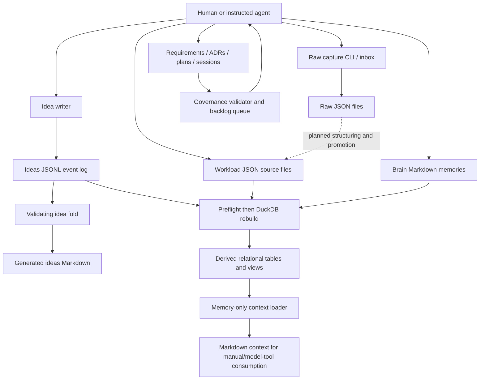

# Architecture actually implemented

D-System currently combines a local workload record store, an event-sourced idea notebook, a curated Markdown memory store, and a document-governance work scheduler. It is not yet the proposed general knowledge-state/transition system. FastAPI and React are scaffolds; most useful behavior runs through Python CLIs and agent instructions. [E01](../evidence/code-evidence.md#e01) (`src/main.py:6-20`) [E02](../evidence/code-evidence.md#e02) (`src/api/__init__.py:1-7`) [E03](../evidence/code-evidence.md#e03) (`ts/src/App.tsx:1-3`) [E04](../evidence/code-evidence.md#e04) (`tools/rebuild_db.py:103-130`) [E14](../evidence/code-evidence.md#e14) (`src/db/ideas.py:225-316`) [E33](../evidence/code-evidence.md#e33) (`schemas/backlog.schema.json:57-142`)

Reviewed snapshot: the commit “Document the recommended build order for the idea-node classification work”, 2026-09-09. Read the [inventory](../evidence/repository-inventory.md) for exclusions. All significant claims cite the [evidence register](../evidence/code-evidence.md), which contains exact excerpts, interpretations, confidence and alternatives. Unless qualified, confidence is HIGH about local implementation, not empirical usefulness or research novelty. Proposed/reference documents remain hypotheses.

Solid edges describe shipped code or instructed human operations; the dotted edge is queued work. The loader does not submit model prompts itself. [E23](../evidence/code-evidence.md#e23) (`tools/load_context.py:29-70`) [E24](../evidence/code-evidence.md#e24) (`tools/load_context.py:73-116`) [E25](../evidence/code-evidence.md#e25) (`tools/rebuild_db.py:331-353`) [E32](../evidence/code-evidence.md#e32) (`src/capture/raw.py:63-128`) [E36](../evidence/code-evidence.md#e36) (`src/governance/backlog.py:116-190`) [E51](../evidence/code-evidence.md#e51) (`docs/09-backlog/backlog.yaml:2649-2719`)

## First-class objects and persistence

| Family | Actual identity and storage | Relationships / semantics | Evidence |
|---|---|---|---|
| Projects, people, tags | JSON sources; `projects`, `people`, `tags` tables | Project encompasses project/activity/goal/system/certification; topical tags and people junctions | [E06](../evidence/code-evidence.md#e06) (`sql/001_schema.sql:4-80`) [E70](../evidence/code-evidence.md#e70) (`schemas/project.schema.json:14-57`) [E73](../evidence/code-evidence.md#e73) (`schemas/tag.schema.json:17-39`) |
| Commitments and tasks | Independent JSON files and tables | Task optionally references commitment and/or project; obligation is not work unit | [E26](../evidence/code-evidence.md#e26) (`schemas/task.schema.json:5-44`) [E27](../evidence/code-evidence.md#e27) (`schemas/commitment.schema.json:5-45`) |
| Interactions | JSON and relational projection | Dated exchange, participant IDs plus unresolved names | [E07](../evidence/code-evidence.md#e07) (`sql/001_schema.sql:95-158`) [E09](../evidence/code-evidence.md#e09) (`tools/rebuild_db.py:180-256`) |
| Decisions | JSON and `decisions` | Choice, rationale, alternatives, optional interaction/people, status and supersedes pointer | [E28](../evidence/code-evidence.md#e28) (`schemas/decision.schema.json:5-54`) |
| Waiting-on | JSON and `waiting_on` | Inbound obligation, separate follow-up dates/states | [E71](../evidence/code-evidence.md#e71) (`schemas/waiting-on.schema.json:5-50`) |
| Development events | JSON and `development_events` | Personal learning events; not software runtime telemetry | [E72](../evidence/code-evidence.md#e72) (`schemas/development-event.schema.json:5-44`) |
| Ideas | One logical six-digit idea ID spanning JSONL events | Creation, status, revisit, amendment, annotation, typed link; effective current state derived | [E11](../evidence/code-evidence.md#e11) (`src/db/ideas.py:45-92`) [E14](../evidence/code-evidence.md#e14) (`src/db/ideas.py:225-316`) [E20](../evidence/code-evidence.md#e20) (`schemas/idea.schema.json:6-24`) |
| Memory | `mem-*` Markdown frontmatter/body, projected into `memories` | Five memory types, confidence, scope, project, systems, related IDs | [E22](../evidence/code-evidence.md#e22) (`schemas/memory.schema.json:17-69`) [E25](../evidence/code-evidence.md#e25) (`tools/rebuild_db.py:331-353`) |
| Raw capture | Individually identified JSON text records | Intake channel, timestamp and optional source path; no implemented meaning extraction | [E32](../evidence/code-evidence.md#e32) (`src/capture/raw.py:63-128`) [E51](../evidence/code-evidence.md#e51) (`docs/09-backlog/backlog.yaml:2649-2719`) |
| Staged record and field evidence | JSON Schema contracts only in the reviewed pipeline | Proposed route and per-field provenance; no shipped staging/review/promotion engine | [E29](../evidence/code-evidence.md#e29) (`schemas/evidence.schema.json:20-94`) [E31](../evidence/code-evidence.md#e31) (`schemas/staged-record.schema.json:5-44`) [E51](../evidence/code-evidence.md#e51) (`docs/09-backlog/backlog.yaml:2649-2719`) |
| Documents / systems / codes | Governed Markdown plus YAML registries | IDs and codes, kinds/statuses, generic dependency DAG, parent plans and supersession | [E37](../evidence/code-evidence.md#e37) (`src/governance/__main__.py:227-301`) [E38](../evidence/code-evidence.md#e38) (`schemas/document.schema.json:37-128`) |
| Phases / sessions | Backlog YAML entries and governed session Markdown | Primary plan, sources, dependencies, acceptance, paths, claim, result and session link | [E33](../evidence/code-evidence.md#e33) (`schemas/backlog.schema.json:57-142`) [E34](../evidence/code-evidence.md#e34) (`schemas/backlog.schema.json:144-240`) [E36](../evidence/code-evidence.md#e36) (`src/governance/backlog.py:116-190`) |

No ORM/domain Pydantic model is implemented: `src/models/__init__.py` is empty. JSON Schema plus dict-based loaders define domain contracts; SQL defines a narrower projection. This is source inspection, not inference from the directory name. [E05](../evidence/code-evidence.md#e05) (`src/db/source_validation.py:136-174`) [E09](../evidence/code-evidence.md#e09) (`tools/rebuild_db.py:180-256`); [inventory](../evidence/repository-inventory.md).

## Relationships and hidden boundaries

Three graph-like structures coexist: idea links and amendments; document/phase dependency graphs; memory `related` arrays. They do not share a generic node/edge identity model or one traversal API. The idea `supersedes` edge is only idea-to-idea; promotion points toward document codes; phase sources use `doc-*` IDs, not those codes. [E12](../evidence/code-evidence.md#e12) (`src/db/ideas.py:133-163`) [E21](../evidence/code-evidence.md#e21) (`schemas/idea.schema.json:42-100`) [E33](../evidence/code-evidence.md#e33) (`schemas/backlog.schema.json:57-142`) [E37](../evidence/code-evidence.md#e37) (`src/governance/__main__.py:227-301`)

JSON remains authoritative. DuckDB is disposable and populated by full DDL recreation, not incremental versioned migrations. Only `sql/001_schema.sql` and `sql/003_capture_views.sql` are installed by the rebuild; there is no migration version table/runner in the inspected implementation. Dropping derived tables does not itself violate source append-only retention, but the rebuild is not atomic. [E04](../evidence/code-evidence.md#e04) (`tools/rebuild_db.py:103-130`) [E10](../evidence/code-evidence.md#e10) (`tools/rebuild_db.py:259-328`)

Source-to-projection fidelity is selective: project `repository` and `stakeholders`, entity `capture`, and commitment `tags` do not survive into their corresponding rows. People-to-project junctions are loaded from `people.projects`. No SQL foreign keys enforce dangling parents. Synthetic probes verify omissions and reference acceptance. [E08](../evidence/code-evidence.md#e08) (`tools/rebuild_db.py:146-178`) [E09](../evidence/code-evidence.md#e09) (`tools/rebuild_db.py:180-256`) [E26](../evidence/code-evidence.md#e26) (`schemas/task.schema.json:5-44`); [probe results](../evidence/review-probe-results.json).

## Lifecycle, execution and context

Ideas have a validating state machine; workload status strings have per-record enum validation without an analogous transition history. Documents constrain legal statuses by kind, and phases derive ready/waiting from dependencies. A constant `session_budget: 1` is a scope promise, not measured runtime. [E14](../evidence/code-evidence.md#e14) (`src/db/ideas.py:225-316`) [E20](../evidence/code-evidence.md#e20) (`schemas/idea.schema.json:6-24`) [E26](../evidence/code-evidence.md#e26) (`schemas/task.schema.json:5-44`) [E37](../evidence/code-evidence.md#e37) (`src/governance/__main__.py:227-301`) [E75](../evidence/code-evidence.md#e75) (`src/governance/backlog.py:195-216`)

The phase is a meaningful coordination boundary: declared paths/systems constrain simultaneous claims and completion requires evidence paths, result text and a session. It is not an automatic phase context package. Agent execution and acceptance judgment remain mediated by instructions and the owner. [E34](../evidence/code-evidence.md#e34) (`schemas/backlog.schema.json:144-240`) [E35](../evidence/code-evidence.md#e35) (`src/governance/backlog.py:30-84`) [E36](../evidence/code-evidence.md#e36) (`src/governance/backlog.py:116-190`) [E43](../evidence/code-evidence.md#e43) (`.claude/commands/session-close.md:6-19`) [E44](../evidence/code-evidence.md#e44) (`.claude/commands/session-close.md:82-110`)

Memory selection is substring/metadata SQL, ranked by confidence and creation date. It does not retrieve ideas, raw captures, decisions or phase outputs as a unified context graph. Triage separately instructs an agent to fold ideas and search documents. Current context can therefore come from several independently selected channels. [E23](../evidence/code-evidence.md#e23) (`tools/load_context.py:29-70`) [E24](../evidence/code-evidence.md#e24) (`tools/load_context.py:73-116`) [E39](../evidence/code-evidence.md#e39) (`.claude/agents/idea-triage.md:15-41`)

Local CI describes tests and builds, not deployment. `/health` says only `{"status":"ok"}`; the synthetic client confirms 200 for health and 404 for `/api/v1/projects`. No runtime-observation-to-knowledge pipeline was found. [E01](../evidence/code-evidence.md#e01) (`src/main.py:6-20`) [E02](../evidence/code-evidence.md#e02) (`src/api/__init__.py:1-7`) [E61](../evidence/code-evidence.md#e61) (`.github/workflows/ci.yaml:1-41`); [probes](../evidence/review-probe-results.json).
