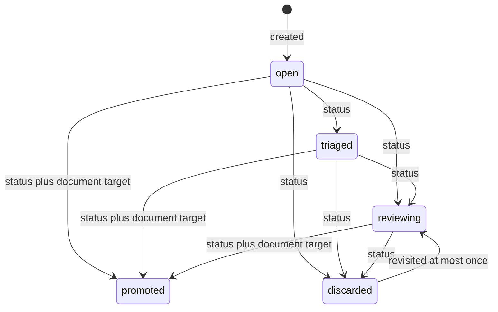

# State transition audit

The claim “the system is append-only” is **CONTRADICTED** when applied globally and **SUPPORTED** for sanctioned idea log writes. Raw intake also avoids intentionally editing existing raw records, with limits below. Source retention, SQL projection replacement and mutable effective in-memory dictionaries are different layers. Do not call a derived `DROP TABLE` destruction of source history. [E16](../evidence/code-evidence.md#e16) (`tools/append_idea.py:190-195`) [E04](../evidence/code-evidence.md#e04) (`tools/rebuild_db.py:103-130`) [E32](../evidence/code-evidence.md#e32) (`src/capture/raw.py:63-128`)

## State machines and representations



`promoted` has no outgoing status transition. A discarded idea reopened once can be discarded again, but cannot be reopened again under the same ID. Annotations and links are allowed even on terminal ideas; corrections do not advance this machine. This is an explicit intake/owner-review lifecycle, not VALIDATE/FALSIFY/DECIDE reasoning. [E14](../evidence/code-evidence.md#e14) (`src/db/ideas.py:225-316`) [E20](../evidence/code-evidence.md#e20) (`schemas/idea.schema.json:6-24`) [E21](../evidence/code-evidence.md#e21) (`schemas/idea.schema.json:42-100`)

| Store / operation | Append-only or mutation | History/reconstruction consequence | Evidence |
|---|---|---|---|
| Idea sanctioned append | Adds one JSONL line | Earlier source events retained; high-level writer checks selected history constraints | [E16](../evidence/code-evidence.md#e16) (`tools/append_idea.py:190-195`) [E17](../evidence/code-evidence.md#e17) (`tools/append_idea.py:222-252`) |
| Idea amendments | Adds correction pointing to event identity | Original and correction retained; effective value resolved recursively | [E12](../evidence/code-evidence.md#e12) (`src/db/ideas.py:133-163`) [E13](../evidence/code-evidence.md#e13) (`src/db/ideas.py:166-205`) |
| Annotation amendment | Replaces effective text, not old bytes | Original attribution persists, but correcting actor/reason not separately recorded | [E18](../evidence/code-evidence.md#e18) (`tools/append_idea.py:311-345`) |
| Link retraction | Appended null-target amendment | Original target survives in raw event; effective link retained with retracted flag | [E19](../evidence/code-evidence.md#e19) (`tools/append_idea.py:349-385`) [E10](../evidence/code-evidence.md#e10) (`tools/rebuild_db.py:259-328`) |
| Source workload JSON | Current records replaceable by file editing | No shipped dated-correction writer, source version chain or general replay | [E04](../evidence/code-evidence.md#e04) (`tools/rebuild_db.py:103-130`) [E28](../evidence/code-evidence.md#e28) (`schemas/decision.schema.json:5-54`) [E51](../evidence/code-evidence.md#e51) (`docs/09-backlog/backlog.yaml:2649-2719`) |
| Brain memory | Current Markdown/frontmatter | Retrieval sees current rebuild snapshot, not memory revisions | [E22](../evidence/code-evidence.md#e22) (`schemas/memory.schema.json:17-69`) [E25](../evidence/code-evidence.md#e25) (`tools/rebuild_db.py:331-353`) |
| Backlog/documents | Current YAML/Markdown edited in place | Status consistency, not a transition ledger | [E36](../evidence/code-evidence.md#e36) (`src/governance/backlog.py:116-190`) [E37](../evidence/code-evidence.md#e37) (`src/governance/__main__.py:227-301`) |
| Checkpoint | Rewrites sections of same session | Interim runs are not individually retained by this mechanism | [E42](../evidence/code-evidence.md#e42) (`.claude/skills/checkpoint/SKILL.md:51-65`) |
| DuckDB | Drop/recreate tables and views | Derived cache of source; source absence removes projected record on rebuild | [E04](../evidence/code-evidence.md#e04) (`tools/rebuild_db.py:103-130`) [E10](../evidence/code-evidence.md#e10) (`tools/rebuild_db.py:259-328`) |
| Generated ideas/glossary/catalog | Regenerated views | Current derived presentation, not additional historical truth | `tools/generate_ideas_md.py:119-137` (`render`); `tools/generate_glossary.py:34-41` (“edit its concept memory…regenerate”); confidence HIGH, alternative: Git may retain committed versions |
| Inbox archive | Source moved to processed filename | Same basename can replace earlier archived input; raw JSON records remain separate | [E32](../evidence/code-evidence.md#e32) (`src/capture/raw.py:63-128`) |

## Temporal and amendment probes

[Reproducible probes](../evidence/review_probes.py) yielded:

```json
"amendment_current": {"title": "Corrected", "updated": "2026-09-01T00:00:00Z"},
"amendment_prefix": "Original",
"time_reversal_accepted": "2026-08-01T00:00:00Z"
```

The correction occurred on September 2. `fold` first resolves all amendments and then skips their events, so effective content changes without a September 2 recency mark. Prefix replay gives the old title, demonstrating *possible* as-of reconstruction from intact JSONL. But there is no shipped general as-of query API or bitemporal valid-time/record-time distinction. Fold order is file order, not timestamp order; a schema-valid imported event earlier than creation can be accepted. Writer clock generation reduces this risk but does not establish monotonic clocks across processes or imported histories. [E13](../evidence/code-evidence.md#e13) (`src/db/ideas.py:166-205`) [E14](../evidence/code-evidence.md#e14) (`src/db/ideas.py:225-316`) [E17](../evidence/code-evidence.md#e17) (`tools/append_idea.py:222-252`)

SQL `idea_events` is not a lossless copy of event JSON: it unwraps amendment `value` and does not retain `set`, so inherit and null-shaped values cannot generally reconstruct raw event shape from rows alone. The source JSONL is the replay authority. The historical test named “any past moment” only counts creation events at a cutoff; it does not establish complete correction-aware reconstruction. [E10](../evidence/code-evidence.md#e10) (`tools/rebuild_db.py:259-328`) [E60](../evidence/code-evidence.md#e60) (`test/test_ideas.py:997-1010`)

## Supersession and dissent

Idea `supersedes` is a semantic assertion; it does not discard the target. A diagnostic flags a target that remains working. Decision `supersedes` is an optional pointer with status active/superseded/reversed; the source preflight does not check that target. Governed documents enforce replacement references and cycles. These three relations should not be treated as one uniform transition contract. [E15](../evidence/code-evidence.md#e15) (`src/db/ideas.py:319-376`) [E28](../evidence/code-evidence.md#e28) (`schemas/decision.schema.json:5-54`) [E37](../evidence/code-evidence.md#e37) (`src/governance/__main__.py:227-301`)

Sibling annotations and independent idea identities preserve conflicting text. Sibling corrections of one field are resolved by append precedence, not preserved as multiple current stances. “Preserves dissenting records” is partly supported; “preserves and arbitrates conflicting reasoning branches” is not implemented. [E13](../evidence/code-evidence.md#e13) (`src/db/ideas.py:166-205`) [E21](../evidence/code-evidence.md#e21) (`schemas/idea.schema.json:42-100`)

## Retention and mutation failure modes

- The prefix test compares working content with HEAD; after arbitrary history rewrite it cannot prove all original events survived. It is useful developer regression protection, not tamper-proof storage. [E59](../evidence/code-evidence.md#e59) (`test/test_ideas.py:724-744`)
- ID allocation and append lack a cross-process lock. Two high-level writers can read the same current state before assigning IDs/appending; collision detection on later fold is not serialization. This is a static failure possibility, not an observed owner-data collision. Confidence HIGH in the absent lock, MEDIUM in operational exposure. [E16](../evidence/code-evidence.md#e16) (`tools/append_idea.py:190-195`) [E17](../evidence/code-evidence.md#e17) (`tools/append_idea.py:222-252`)
- Duplicate project IDs pass preflight and fail after table recreation. Probe result: `ConstraintException`, old projection count `0`, partial new count `1`. Old source history is not destroyed, but prior queryable projection availability is lost. [E04](../evidence/code-evidence.md#e04) (`tools/rebuild_db.py:103-130`) [E05](../evidence/code-evidence.md#e05) (`src/db/source_validation.py:136-174`)
- Raw writer checks existence before `write_text`, not atomic exclusive creation. No forced concurrent collision was tested. Inbox CRLF normalization and processed-name replacement **were** reproduced. The two raw records survive; the first archived original bytes do not. [E32](../evidence/code-evidence.md#e32) (`src/capture/raw.py:63-128`); [results](../evidence/review-probe-results.json).

Confidence HIGH for reproduced behavior. Alternative: normalized text and disposable cache may be sufficient for personal operation; they do not support the broader archival/reconstruction claims without qualification.
